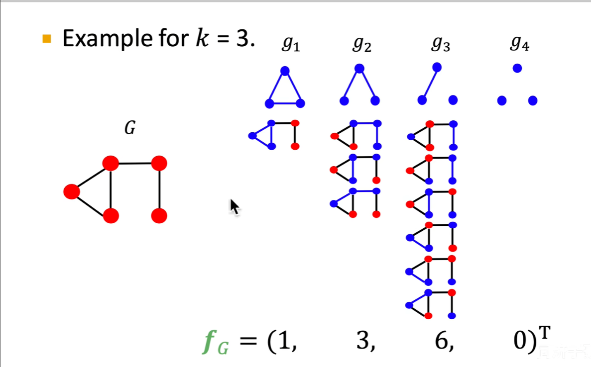
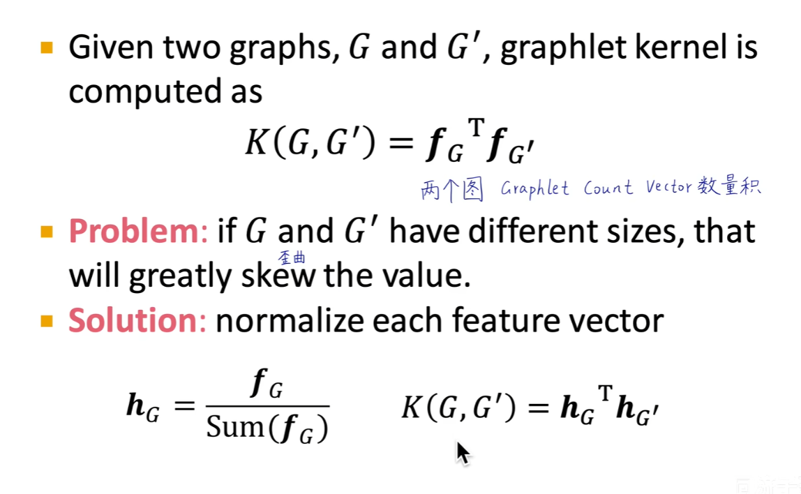
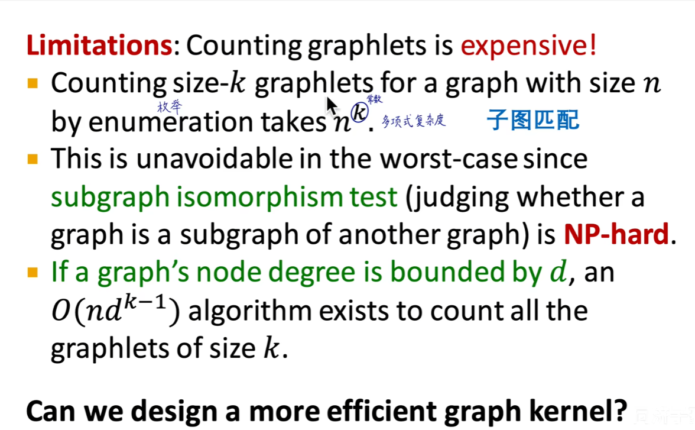
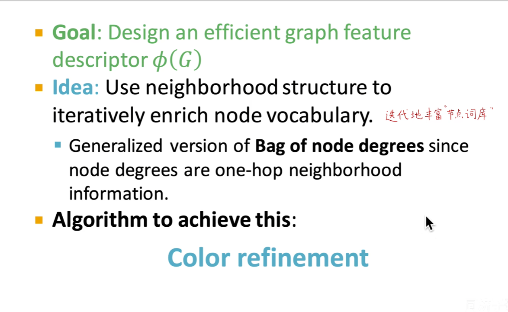
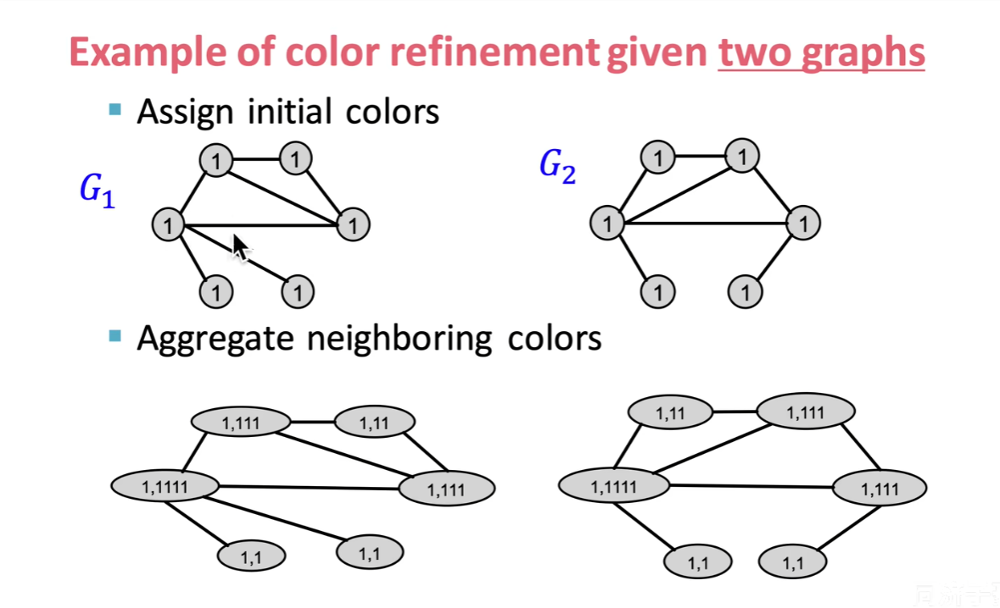
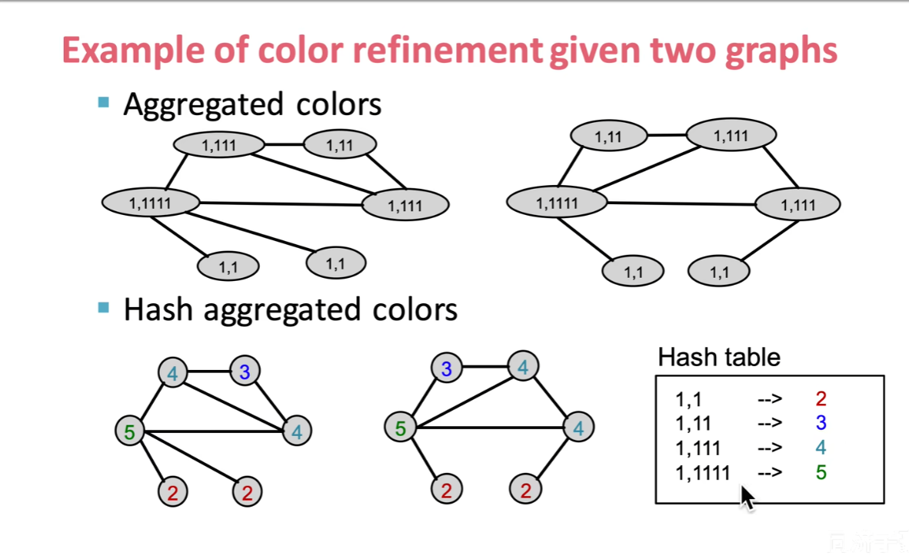
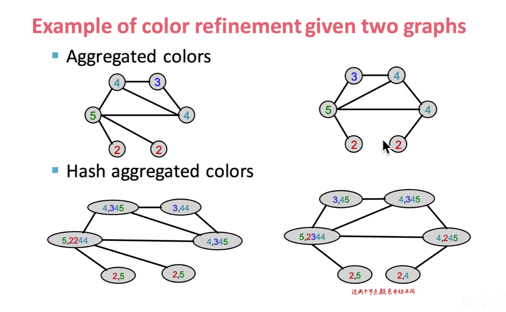
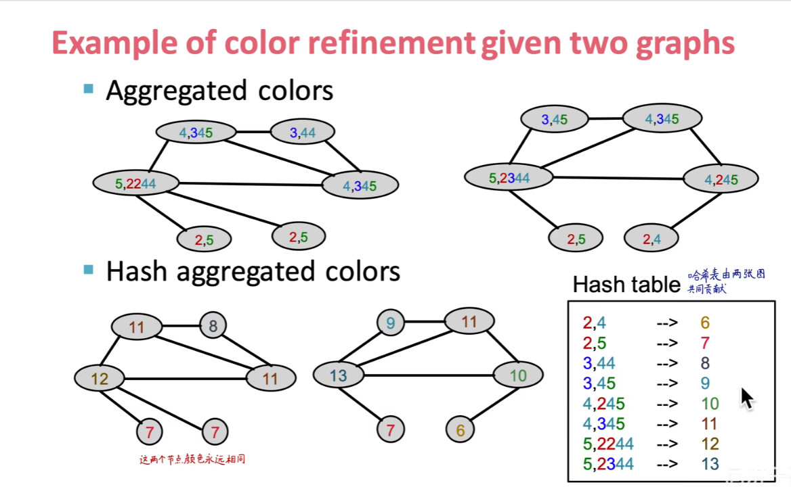

# 图特征提取与图核方法 (Graph Features & Graph Kernels) 学习笔记

## 一、 核心思想：Bag of "!!" (词袋模型的图扩展)

在自然语言处理中的“词袋模型”（Bag of Words）思想被广泛借鉴到图特征提取中。图的特征可以看作是其内部某种子结构的频次集合。

* **Bag of Node Degree (节点度数袋)：** 最简单的形式，统计图中各个度数的节点分别有多少个。
* **Bag of Graphlet Features (图元特征袋)：** 统计图中各种“图元”（Graphlets，即固定大小的非同构连通/非连通子图）的出现频次。
    * **特点：** 允许存在孤立节点，并且是从全图的宏观视角来统计的。

---

## 二、 Graphlet Kernel (图元核)

Graphlet Kernel 的核心思想是通过计算两个图中不同 Graphlets 的数量分布，来衡量图与图之间的相似度。

* **计算方式：** 将两个图分别表示为 Graphlet 频次的向量，然后计算向量的点积。
* **致命缺点 (费算力)：** 统计图中大小为 $k$ 的 Graphlet 需要解决子图同构问题。这是一个 **NP-Hard**（NP难）问题，计算复杂度极高，难以应用于大规模图。

---

## 三、 Weisfeiler-Lehman (WL) Kernel (WL核)

为了解决 Graphlet Kernel 计算复杂度过高的问题，WL Kernel 被提出。它基于颜色细化（Color Refinement）算法，通过迭代式地聚合邻居信息来区分节点状态。

### WL 算法演练实例：

* **Step 1: 初始化颜色 (Initial Colors)**
    给图中的每个节点分配初始颜色（通常用节点的度数或相同的初始值作为标签）。
    

* **Step 2: 聚合与哈希 (Hash Neighbor Colors)**
    每个节点收集其邻居的颜色，并将自己的颜色与邻居的颜色集合拼接成一个字符串，然后进行 Hash 映射。
    

* **Step 3: 更新节点颜色 (Update Colors)**
    根据 Hash 映射的结果，为每个节点分配新的颜色标签。
    

* **Step 4: 继续迭代 (Next Iteration Hash)**
    重复上述聚合和哈希的过程。
    

> **核心结论：** 算法可以继续重复，不同网络拓扑结构位置的节点，其最终被分配的颜色会逐渐不同。最后做出的一个特征向量，就是每种颜色（Hash 标签）的节点个数。

---

## 四、 WL Kernel 总结与模型关联

* **思想本质：** **Bag of colors** (颜色袋)。我们将图表示为迭代过程中出现的所有颜色的频次向量。
* **感受野：** 迭代 $k$ 步，就捕捉到了长为 $k$ 的路径 (k-hop) 的拓扑结构信息。
* **复杂度优势：** 与图的节点个数/边数呈**线性相关**，计算效率极高。
* **与图神经网络高度关联：** WL 测试是 GNN 表达能力的理论上限。例如著名的 GIN (Graph Isomorphism Network) 就是基于 1-WL 测试等价性被推导出来的。

---

## 五、 Kernel Methods (核方法)：计算、归一化与意义

图核方法（Graph Kernels）的核心目的，是将非欧式空间的图结构数据转化为**相似度矩阵**，进而让传统机器学习算法（如 Kernel SVM）可以直接处理图分类任务。

### 1. 向量相乘的意义 (Kernel 计算)
无论是 Graphlet 还是 WL 颜色，最终都会把图 $G$ 映射为一个频次特征向量 $\phi(G)$。核函数 $K$ 就是计算两个图特征向量的**内积（点积）**：
$$K(G_1, G_2) = \phi(G_1)^T \phi(G_2)$$
**几何意义：** 向量相乘是在计算两个图结构的重合度。拥有相同局部结构越多的两张图，乘积数值越大，说明它们越相似。

### 2. 注意！归一化 (Normalization) 是必选项
**痛点：** 如果图 $G_1$ 包含 10 个节点，图 $G_2$ 包含 1000 个节点，图 $G_2$ 产生的特征向量数值会远大于图 $G_1$。此时直接计算点积，会导致“大图和任何图的相似度都很高”的假象。
**解决方案：** 必须对 Kernel 值进行归一化（余弦相似度思想），将相似度缩放到特定区间（如 $[0, 1]$）：
$$K_{norm}(G_1, G_2) = \frac{K(G_1, G_2)}{\sqrt{K(G_1, G_1) K(G_2, G_2)}}$$

或者把Kernel归到01区间内再相乘

---

## 六、 其他常见的图核方法

除了 Graphlet 和 WL Kernel，还有以下常见核方法：
* **Random Walk Kernel (随机游走核)：** 统计两个图在张量积图上的随机游走路径数量。
* **Shortest Path Kernel (最短路径核)：** 比较两个图中所有节点对之间的最短路径长度分布。
* **Neighborhood Subgraph Pairwise Distance Kernel (NSPDK)：** 结合局部邻域子图及其之间的距离信息。