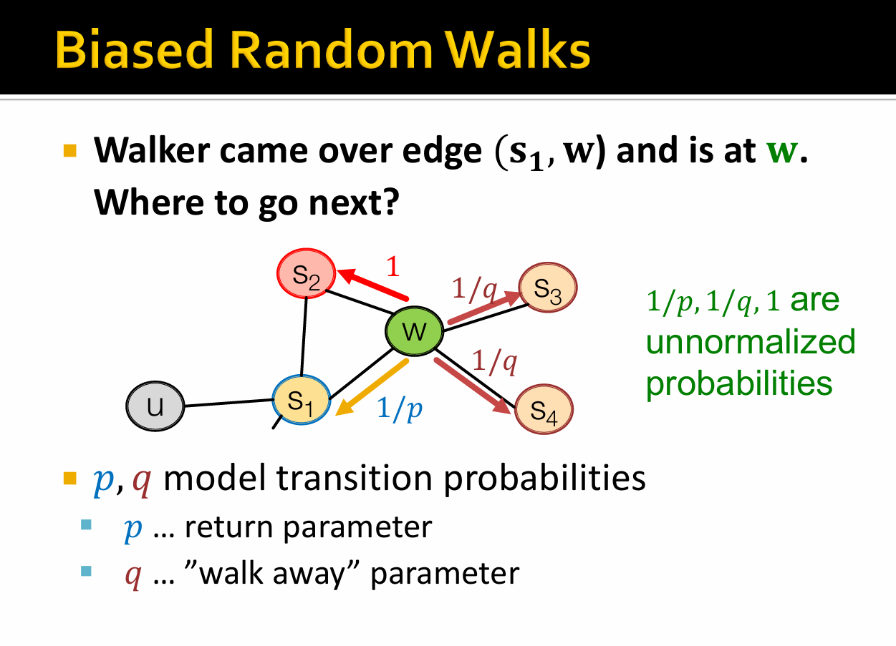
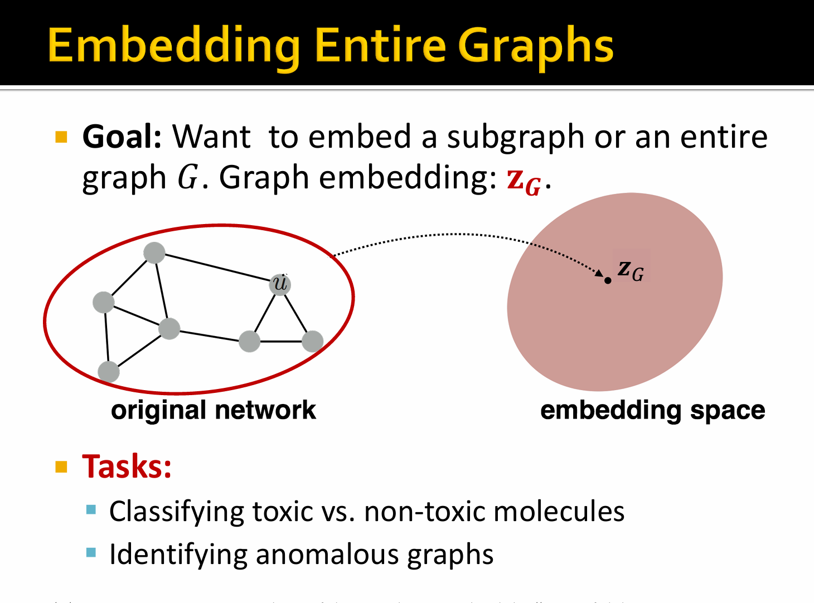
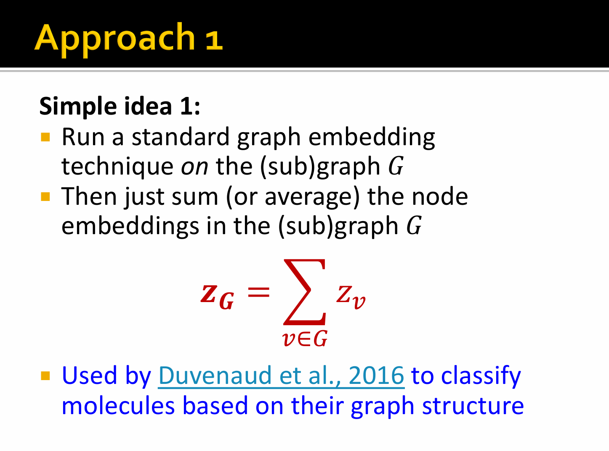
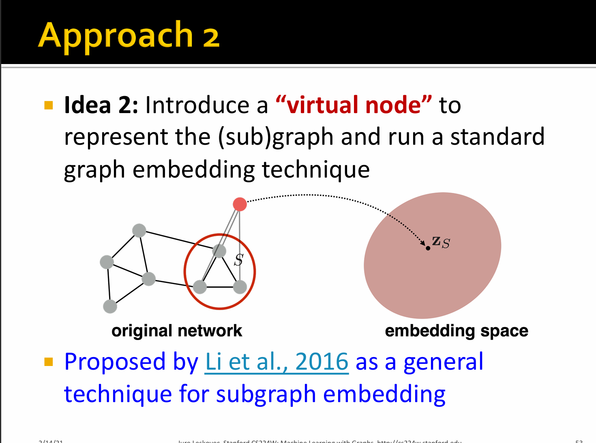
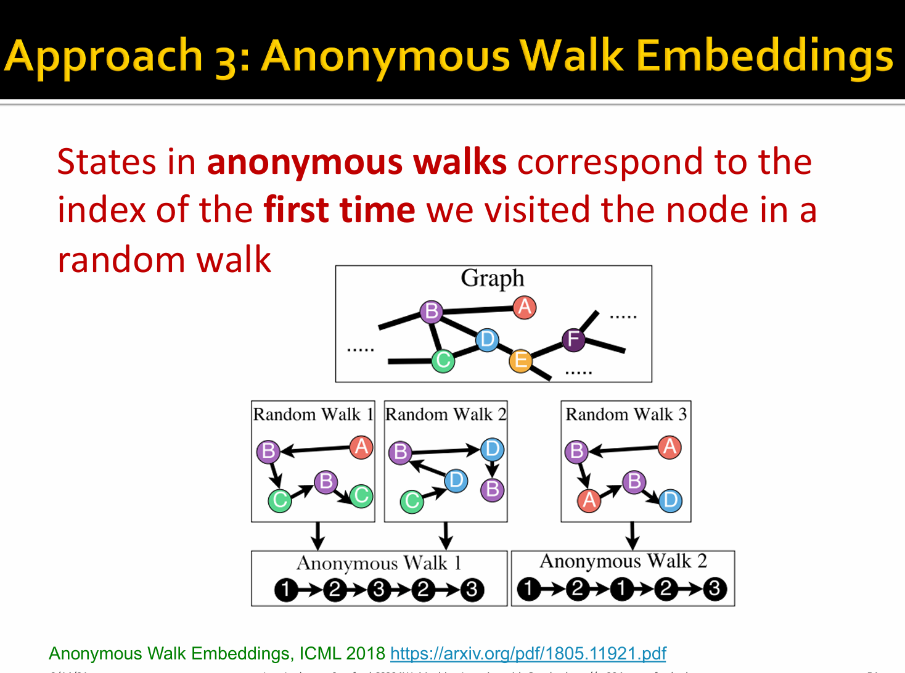
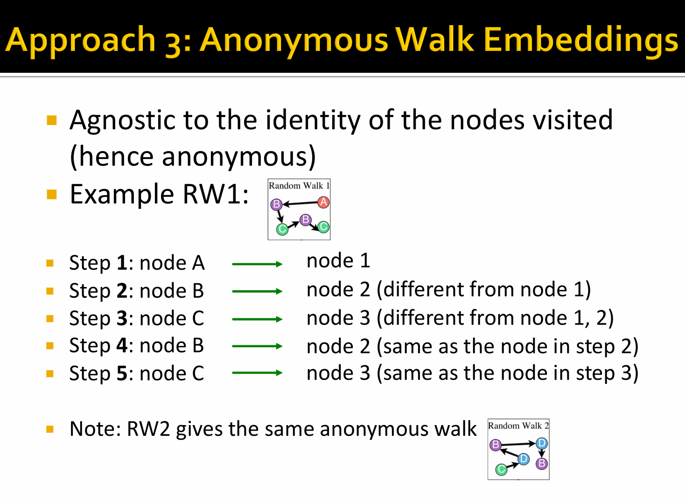
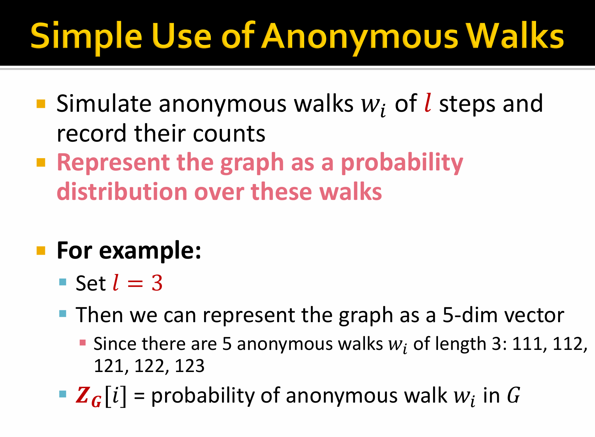
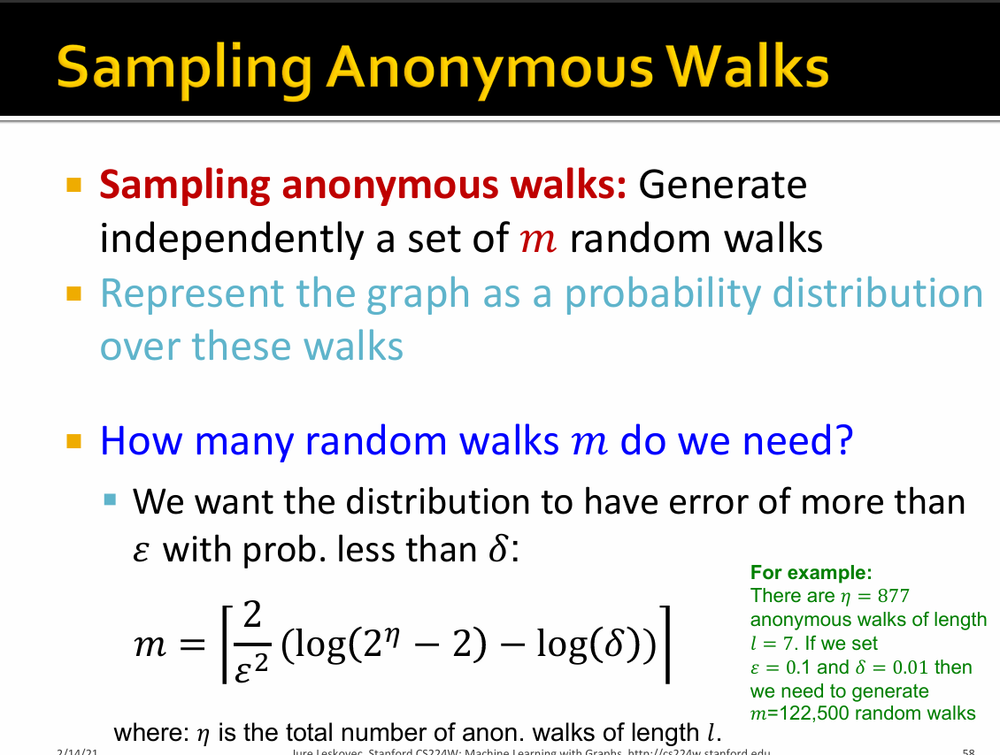

# 图表示学习 (Graph Representation Learning)：从手工特征到无监督嵌入

## 一、 时代背景：从人工到自动
* **之前的方法 (特征工程)：** 比如我们前面学的 Node Degree、Graphlets、WL Kernel 等。这些都需要人类专家凭借经验去定义“什么样的图结构是重要的”，费时费力。
* **本节的方法 (无监督表示学习)：** 不再依赖人工定义，而是让算法自己去图里“逛一逛”（比如随机游走），自动捕捉节点的局部和全局结构信息。代表方法包括 DeepWalk、Node2Vec 以及矩阵分解。

---

## 二、 核心概念：什么是图嵌入 (Graph Embedding)?

**Recap (回顾)：**

图嵌入的本质，就是**将网络中的节点映射为一个 $d$ 维的稠密向量 (Dense Vector)**。

**嵌入的意义 (为什么要费劲转成向量？)：**
1.  **与下游任务无关 (Task-agnostic)：** 学习到的向量是通用的，拿去算节点分类、链路预测、图聚类都可以，不需要为每个任务重新算一遍特征。
2.  **编码图信息：** 向量在高维空间中的相对位置，完美保留了原图中的网络拓扑结构（比如：在图里离得近的两个节点，它们对应的向量在空间里的距离也很近）。

---

## 三、 图嵌入的基本通用框架 (Encoder-Decoder)

任何图嵌入算法，几乎都可以套用这个“四步走”框架：

1.  **Encoder (编码器)：** 定义一个映射函数 $ENC(u)$，把原图中的节点 $u$ 变成一个向量 $z_u$。
2.  **Define Similarity (定义相似度)：** 在原图 (Original Network) 中定义一种相似度 $similarity(u, v)$。比如：两个节点之间有边，或者它们在同一条随机游走路径上，就算相似。
3.  **Decoder (解码器)：** 在嵌入空间 (Embedding Space) 中，用解码器 $DEC(z_u, z_v)$ 来计算这两个向量的相似度（通常就是计算两个向量的**点积/内积** $z_u^T z_v$）。
4.  **Optimize (优化目标)：** 调整 Encoder 的参数，使得：向量空间算出来的相似度，尽可能**等于**原图里定义的相似度。
    $$DEC(ENC(u), ENC(v)) \approx similarity(u, v)$$

---

## 四、 浅层编码 (Shallow Encoding)

**浅层编码**是最简单、最基础的 Encoder 实现方式，本质上就是一个**查表操作 (Embedding Lookup)**。

* **直白解释：** 假设图里有 $N$ 个节点，我们要把每个节点变成 $d$ 维向量。我们就直接初始化一个大小为 $d \times N$ 的大矩阵 $Z$。
* 矩阵的每一列，就是对应节点的向量。
* 当我们要找节点 $u$ 的向量时，就是用一个 One-hot 向量去和矩阵 $Z$ 相乘，把属于 $u$ 的那一列“抽”出来。
* **注意：** DeepWalk 和 Node2Vec 都是基于 Shallow Encoding 的！优化模型，其实就是在不断调整更新这个大矩阵 $Z$ 里的数字。

---

## 五、 核心重头戏：随机游走 (Random Walk Approaches)

如何定义原图里的相似度？**随机游走**给出了最巧妙的答案。

### 1. 什么是随机游走？
想象一个醉汉在图的节点上游荡，他站在节点 $u$ 上，下一步随机走向相邻的节点，不断重复，这就形成了一条“游走序列”。
* **相似度定义：** 如果节点 $u$ 和节点 $v$ 经常出现在同一个游走序列中（两人经常偶遇），我们就认为它们是相似的！

### 2. 为什么要用随机游走？
* **极高的表达能力：** 它既能看朋友（局部信息），也能看朋友的朋友（高阶/全局信息）。
* **计算效率高：** 不需要看全图，只需要在小局部游走，非常适合极大规模的网络。

### 3. 算法步骤与数学公式 

* **目标：** 给定一个起始节点 $u$，我们要最大化它的邻居节点 $v$ 出现在它周围的概率 $P(v|u)$。
* **公式化 (Softmax)：** 我们用两个节点向量的点积 $z_u^T z_v$ 来代表它们“偶遇”的得分。得分越高，概率越大。我们用 Softmax 函数把得分变成 $0$ 到 $1$ 之间的概率：
    $$P(v|u) = \frac{\exp(z_u^T z_v)}{\sum_{n \in V} \exp(z_u^T z_n)}$$
    * **分子：** 节点 $u$ 和 $v$ 向量点积的指数。
    * **分母：** 节点 $u$ 和图中**所有**其他节点点积指数的总和（为了做归一化）。
* **通俗理解：** 我们希望 $u$ 和真正相似的 $v$（在同一个序列里）的点积尽量大，而和不相干的节点点积尽量小。

### 4. 经典算法演进：DeepWalk vs Node2Vec

这俩算法的核心区别，就在于**“怎么走”**。

* **DeepWalk：** **无脑走。**
    在每个节点上，不管三七二十一，对所有邻居等概率地随机选一个走下一步。
    
* **Node2Vec：** **有策略地走 (Biased Random Walk)。**
  
    它引入了两个参数，控制醉汉是“喜欢宅在家里”还是“喜欢往外跑”：
    * **返回参数 $p$：** 控制游走回到刚离开的节点的概率。如果 $p$ 很小，游走就会像 BFS（广度优先搜索），一直在起点附近绕圈圈，这能很好地捕捉**局部的微观视图**。
    * **进出参数 $q$：** 控制游走走向更远节点的概率。如果 $q$ 很小，游走就会像 DFS（深度优先搜索），一直往外探索，这能很好地捕捉**全局的宏观视图**。
    
    
    
    
    
    
    
    
    
    
    

## 全图嵌入

 **目标**：希望嵌入一个子图或完整的图 *G*。**图嵌入**：

### 1节点特征平均

### 2 虚拟节点子图

 [[1511.05493\] Gated Graph Sequence Neural Networks](https://arxiv.org/abs/1511.05493) 

### 为什么需要它？标准 GNN 的局限

标准 GNN（如 GCN、GAT）通过逐层消息传递来聚合节点信息。但面对大图或稀疏图时，存在两个根本性瓶颈：

**过度压缩（Over-squashing）**：远距离节点的信息在多轮聚合后被"压缩"进固定维度的向量，导致信息丢失。

**图直径问题**：若要让 A 节点感知到 k 步之外的节点 B，必须堆叠 k 层 GNN，计算代价随图直径指数增长。

### 虚拟节点子图嵌入法详解

**核心思想**：向图中添加一个（或多个）不对应真实实体的"超级节点"，并将其与图中的**所有节点**连接（双向或单向）。这样：

- 任意真实节点到虚拟节点只有 1 跳
- 虚拟节点充当全局信息"总线"，打破图的直径瓶颈
- 经过 2 层 GNN 后，任意两个节点都可以通过虚拟节点互相感知

虚拟节点的初始特征通常设为**零向量**或可学习的嵌入向量，其更新方式与真实节点相同，只是在消息传递中充当"全局上下文"角色。

复用标准算法：在扩展后的图（原图 + 虚拟节点）上运行任意标准图嵌入算法（如 DeepWalk、Node2Vec、GCN、GAT 等），学习得到虚拟节点的嵌入向量 zS，这个向量就代表了整个子图 S 的嵌入。

### 关键变体与扩展

#### 1. 多虚拟节点（Multi-VN）

为不同的"语义角色"分别设置虚拟节点：例如一个 vn 聚合全局拓扑信息，另一个聚合节点特征分布。各虚拟节点之间也可以互相连接。

#### 2. 分层虚拟节点（Hierarchical VN）

对大图进行分块后，每个块使用一个局部虚拟节点，再在所有局部虚拟节点之上设置一个全局虚拟节点。类似于"段落摘要 → 文章摘要"的结构。

#### 3. 子图采样 + VN（Subgraph Sampling with VN）

在大规模图学习中，先对目标节点的邻域进行子图采样（如 GraphSAINT、ClusterGCN），然后在每个采样子图中插入虚拟节点，再聚合为子图嵌入，最后在全图层面合并。

#### 4. 虚拟边（Virtual Edge）的泛化

将虚拟节点的思想推广到虚拟边：在语义上相关但图中不相邻的节点之间添加虚拟边，并赋予特殊的边特征，以此丰富远程依赖的建模能力。

### 3

长度越长，其可能性越多

### 1. 核心目标

- **采样匿名游走**：独立生成 m 条随机游走（random walks）。
- **图的概率分布表示**：把图的结构信息，编码成这 m 条游走之上的概率分布。
- **关键问题**：到底要生成多少条游走 m，才能让这个分布足够 “准”？

------

### 2. 误差约束条件

我们希望：

> 分布的误差超过 ε 的概率，小于 δ。

也就是：

- ε：允许的**最大误差**（比如 0.1，即 10%）
- δ：误差超标的**最大容忍概率**（比如 0.01，即 1%）

------

### 3. 采样数量公式

$$
m = \left\lceil \frac{2}{\varepsilon^2} \left( \log(2^n - 2) - \log(\delta) \right) \right\rceil
$$

其中：

- η：长度为 l 的**匿名游走总数**
- ⌈⋅⌉：向上取整（保证 m 是整数）
- log：通常指自然对数 ln（也可根据上下文是 log2，但形式不变）

------

### 4. 例子计算（帮你算一遍）

已知：

- η=877（长度 l=7 的匿名游走总数）
- ε=0.1
- δ=0.01

代入公式：

m=⌈0.122(log(2877−2)−log(0.01))⌉≈⌈200×(609.0−(−4.605))⌉=⌈200×613.605⌉=⌈122721⌉≈122,500

和例子里的结果 m=122,500

------

### 💡 直观理解

- 要让分布更准（ε 更小）、更稳（δ 更小），m 就要变大。
- 匿名游走种类 η 越多，需要的 m 也越多，因为要覆盖更多可能的游走模式。
- 这个公式本质是**概率近似正确（PAC）学习**里的样本复杂度 bound，用来保证采样分布和真实分布足够接近。

------

如果你需要，我可以帮你把这个公式的 ** 理论来源（比如 Hoeffding 不等式）** 也拆解出来，让你更懂背后的统计学原理。要我补充吗？

