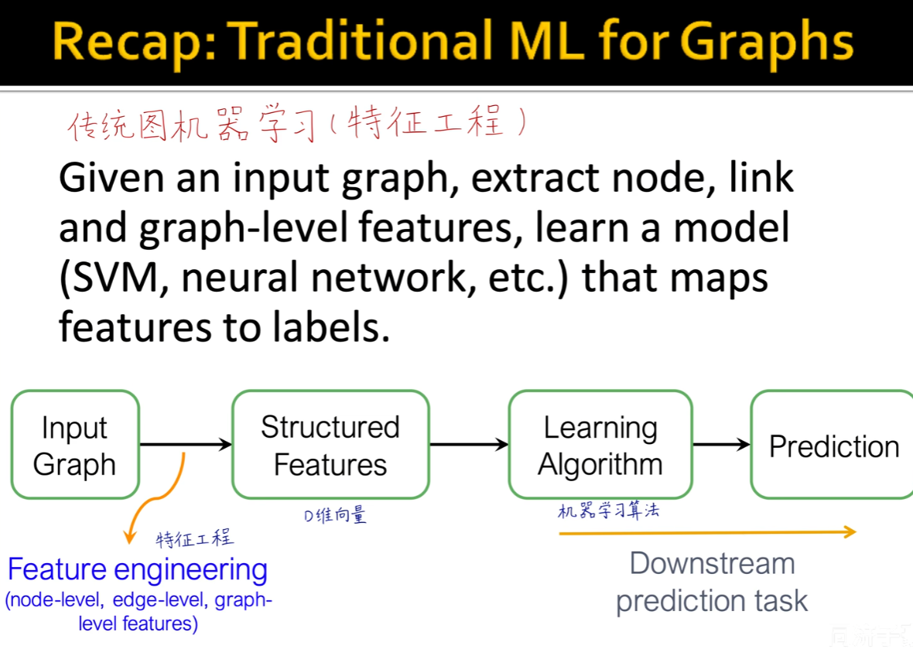
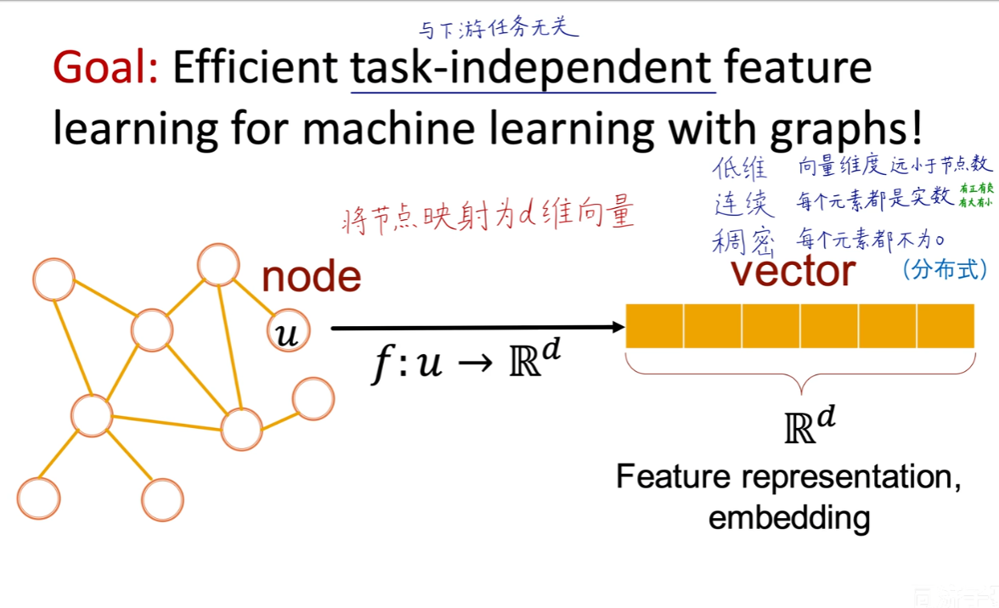
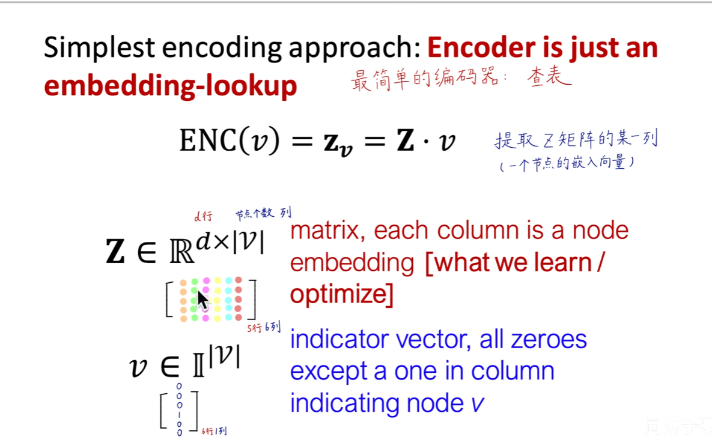
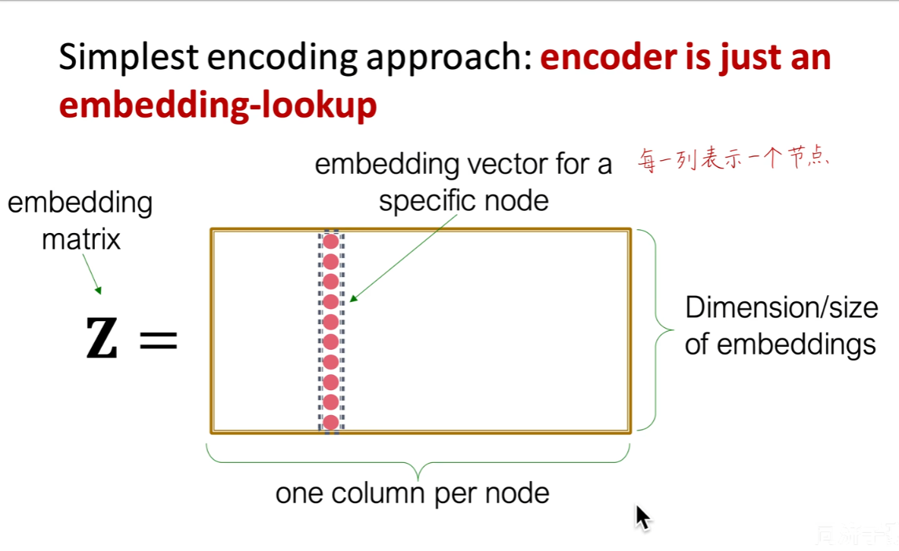
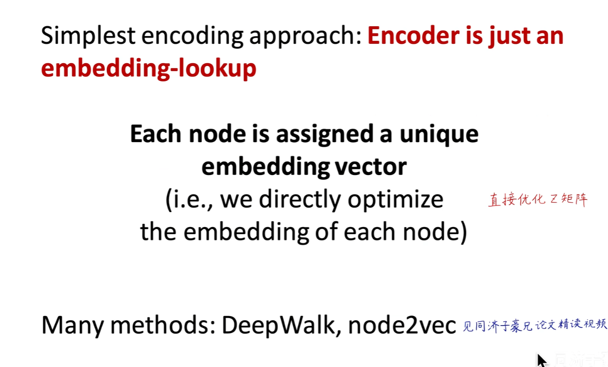

之前大多是人工特征工程的方法

本节就是无监督的方法

图表示学习（随机游走构造的，DeepWalk，Node2Vec），矩阵分解

后面还有神经网络的方法

Recap

将节点映射为d维向量

嵌入意义：

与下游任务无关

编码图信息

...

图嵌入基本框架：

1encoder：

ENC(u)

2Define similarity（u，v） = （也可以换）

Original net work --》 embedding space

3decoder：

DEC

objective

exp：

....

4Optimize the parameters of the encoder so that

...

similarity    约等于   ..

Shallow Encoding

....

Random Walk Approaches 

