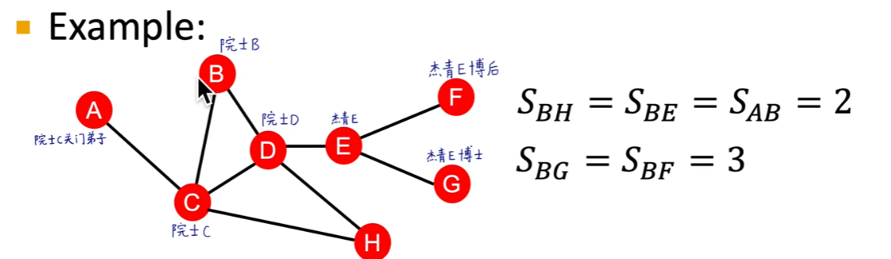
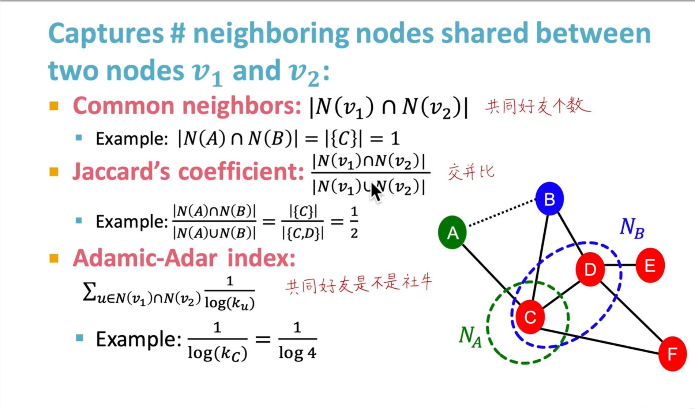
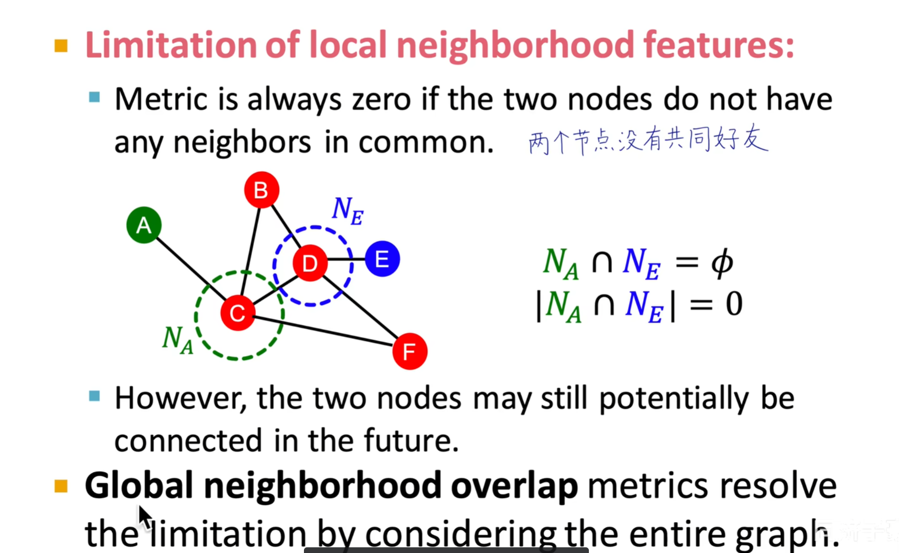
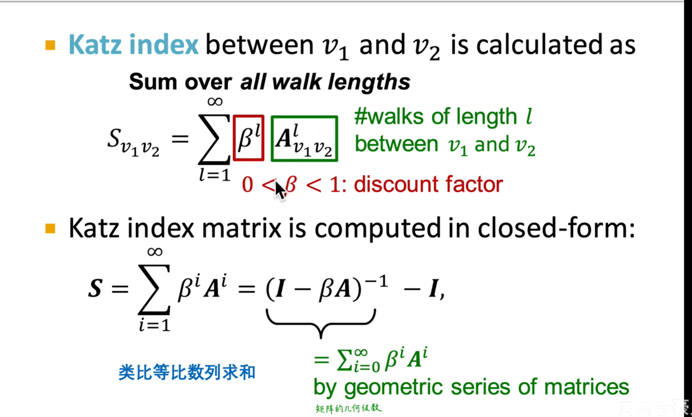

# Link Prediction 与连接特征提取

## 一、 链路预测的核心问题
链路预测的本质是通过已知的图结构来补全（预测）未知的连接。
**核心挑战：** 如何提取 Link（边/连接）本身的特征，并将其表示为一个 $D$ 维的向量，进而转化为机器学习中的分类或回归问题。

### 链路预测的两大任务类型
1. **静态链路预测 (Static Link Prediction):**
   * **场景：** 补全缺失的图结构（例如推荐系统、蛋白质相互作用网络）。
   * **方法：** 在训练时随机掩盖（删掉）一部分真实存在的连接，然后让模型尝试将这些隐藏的连接预测出来。
2. **动态链路预测 (Dynamic Link Prediction):**
   * **场景：** 预测图结构的未来演化（例如社交网络的关注预测）。
   * **方法：** 给定时刻 $t$ 的图状态，预测下一时刻 $t+1$ 哪些节点之间会产生新的连接。利用时刻 $t+1$ 的真实图数据作为 Ground Truth 进行验证。

---

## 二、 链路特征提取方法 (Link-level Features)

为了将节点对 $(u, v)$ 表示为向量，我们通常从以下几个维度提取特征：

### 1. 基于距离的特征 (Distance-based Features)
最直观的方法，测量节点之间的物理拓扑距离。
* **Shortest Path (最短路径)：** 计算节点 $u$ 和 $v$ 之间的最短路径长度（通常不考虑边的权重，只看跳数）。

### 2. 基于局部邻域的特征 (Local Neighborhood Overlap)
基于“共同好友越多，两人越可能认识”的假设。

* **Common Neighbors (共同邻居)：** 直接统计两节点的交集邻居数量 $|N(u) \cap N(v)|$。
* **Jaccard Coefficient (杰卡德系数)：** 共同邻居占所有邻居的比例，用于消除度数过大带来的影响。
* **Adamic-Adar Index / Resource Allocation：**
  * **通俗理解：** 如果两人的共同好友是个“社牛”（节点度数极大），那么这个共同好友对两人建立连接的贡献度其实是比较弱的；相反，如果共同好友是个“社恐”（只认识他们俩），那么这俩人认识的概率极高。
  * **机制：** 对每个共同好友的度数取倒数（或对数倒数）进行惩罚。

**局部特征的缺点：**
当两个节点没有共同邻居（即 Local Overlap 为 0）时，这些指标无法区分它们。即使它们可能通过一条极短的路径（如 3-hop）相连，局部特征也会完全失效。

---

### 3. 基于全局邻域的特征 (Global Neighborhood Overlap): Katz Index
为了弥补局部特征视野受限的问题，**Katz Index** 被提出。它不仅看共同邻居（2-hop），而是考虑两个节点之间**所有长度**的路径。

* **核心思想：** 节点 $u$ 和 $v$ 之间长度为 $l$ 的路径个数越多，说明它们联系越紧密。路径越长，其贡献度应该越弱。
* **计算技巧：** 节点之间长度为 $l$ 的路径数，可以直接通过**图的邻接矩阵的 $l$ 次方 ($A^l$)** 求得。

**Katz Index 数学定义：**
对于节点 $u$ 和 $v$，计算它们之间所有可能路径的加权总和：

$$Katz(u, v) = \sum_{l=1}^{\infty} \beta^l \cdot A^l_{uv}$$

* **$A$：** 图的邻接矩阵（Adjacency Matrix）。
* **$l$：** 路径的长度。
* **$A^l_{uv}$：** 邻接矩阵 $A$ 的 $l$ 次方在 $(u, v)$ 位置上的值，代表节点 $u$ 到 $v$ 之间长度为 $l$ 的路径条数。
* **$\beta$：** 衰减因子（阻尼系数）。
  * 通常是一个很小的正数。
  * **约束条件：** 需满足 $0 < \beta < \frac{1}{\lambda_{max}}$，其中 $\lambda_{max}$ 是邻接矩阵 $A$ 的最大特征值，这是为了保证无穷级数能够收敛。
  * **作用：** 让长路径的权重随长度的增加而呈指数级衰减。

